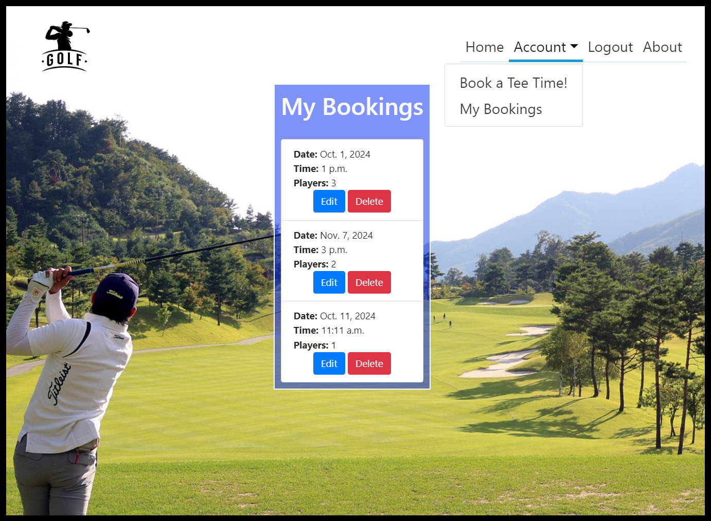

# Golf Booking Site

## Table of Contents:

1. UX-Design
    - Planning
        - Design Thinking 
        - Agile
        - User Stories
        - Website Flow
    - WireFrames
        - Styles
        - Fonts
        - Colours

2. Database Model
    - ERD

3. Features
    - Existing Features
    - Future Features

4. Technologies Used
    - Languages
    - Frameworks and Libraries
    - Tools

5. Manual Testing
    - Responsiveness
    - Browser Compatibility
    - Lighthouse
    - Code Validation
    - User Stories
    - Features
    - Bugs

6. Deployment
    - Heroku

7. Credits

## UX-Design
### Planning
#### Design Thinking:

From the start when developing this website I imagined the site from the users perspective. This immediately posed questions such as: 
- Why would a user want to visit this website?
    - The website provides a booking service for tee times on a golf course.
- What would bring a user back to the website?
    - A user would return to the website if they experience a user-friendly interface with easy navigation and a streamlined booking service.

#### Agile Planning:

An agile approach was taken for the planning of this website. This allowed me to take an iterative strategy towards the projects goals and break down the user stories into smaller tasks, I thought about these in terms of accepted criteria(AC). Also this allowed me to be flexible throughout the websites development and refine, adjust and add features to the website as needed. A kanban board was used for project management where I could assign labels of 'Must Have', 'Could Have' and 'Should Have' to my user stories. As I worked on each I moved them from 'Todo' to 'In Progress' to 'Done' which gave me a clear plan of what stage the project was in and which features took priority.

#### User Stories:

The user stories were written from the users perspective. This gave me the opportunity to envisage what a user would want to see on the home page, login page etc. The following user stories were completed throughtout the development of the website:
- New User Registration
    - As a 'non-registered user' I can 'create an account' so that 'I can use the websites service'.
- Login/Logout
    - As a 'registered user' I can 'login and logout' so that 'I can access my account securely'.
- Make a Booking
    - As a 'registered user' I can 'access a booking page' so that 'I can book a tee time'.
- View a Booking
    - As a 'registered user' I can 'access a list of my bookings' so that 'I can view my bookings'.
- Update a Booking
    - As a 'registered user' I can 'access a list of my bookings' so that 'I can update a booking'.
- Delete a Booking
    - As a 'registered user' I can 'access a list of my bookings' so that 'I can delete a booking'.

#### Website Flow:

Writing the user stories allowed me to visualise how the website would take form and what features should be where and when they should be there.

### Wireframes

Balsamiq was leveraged for making wireframes which would guide the development process.

- Home page

  

 

- Registration page

  

 

- Login page

  

 

- Booking page

 

- My bookings page

  

 

#### Styles:
- This website follows a minimilistic approach with clean lines and easy user navigation.

#### Colours:
- For user readability a vibrant blue was used as the primary colour with a contrasting white for the text.

## Database Model
### ERD:

- The ERD shows the Booking model and its associated fields. The user field has a many to one relationship with djangos built-in User model as a single user can have many bookings but each booking is related to only one user.

## Features
### Existing Features:

- Header
    - Logged out - shows the logo and gives options to register new account, login and see the about page for the website.
    

    - Logged in - also shows logo and about page and gives options for booking a tee time, viewing my bookings and safely logging out of my account.
    

 

- Footer

 

- Home Page 
    - Logged out

    
    
    - Logged in

    

   

- Register New Account

 

- Login

 

- Book a Tee Time

 

- My Bookings

 

- Update Booking

 

- Delete Booking

 

- About page

 

### Future Features:

- New password functionality to allow a user to change if their password if lost or forgotten.

- Email verification for bookings.

## Technologies Used
### Languages

- HTML was used to create the structure of the websites pages.

- CSS was used to style the web pages.

- Javascript used to create interactive and dynamic web pages.

- Python was used as the backbone of this project for creating models, forms and views.

### Frameworks and Libraries

- Django was used as the main Python framework in the development of this website. It is a high-level Python web framework that encourages rapid development and clean, pragmatic design.

- Bootstrap was used as the main front-end development framework. It is very effective in creating visually appealing and responsive web designs.

- Django Crispy Forms was used for rendering the forms.

### Tools

- PostgreSQL was used for its relational database management system.

- Github for version control and storing the projects code.

- Balsamiq for design wireframes.

- Google for research.

- dbdiagram for creating booking model ERD.

## Testing

| Feature | Expected Outcome | Testing Performed | Result | Pass / Fail | 
| ----- | ----- | ----- | ----- | ----- |
| A user loads the site | Home page with welcoming message | Loaded site | Home page loaded with clear welcoming message | Pass |
| Logo links to home page | When logo is clicked I get redirected to home page | Logo clicked from all pages on site | Redirected to home page | Pass |
| Navbar links | Redirected to correct page on site | All links were clicked from different site pages | The correct pages were rendered from all navbar links | Pass |
| Register new account | When this link is clicked user is redirected to registration form | Form filled out correctly and incorrectly | Alert messages display showing user what fields need filling or adjusting | Pass |
| Registration pop up message | Registered new account is clearly stated to user | New accounts registered | Pop up shows every time welcoming user | Pass |
| Login | User can login to their account by entering username and password | Log in form correctly and incorrectly filled out | With valid login details user logged in to correct account, invalid details prompt an alert message | Pass |
| Login pop up message | After logging in successfully a pop up message shows stating such and welcoming the user | Logged in numerous times | Pop up message shows every time | Pass |
| Navbar changes when user logs in | After successful login navbar changes to show account and logout options | Logged in numerous times | Navbar shows account dropdown options and logout | Pass |
| Home page changes when user logs in | After successful login home page changes to give user a booking option | Logged in numerous times | Home page changes correctly when user successfully logs in | Pass |
| Logout | Logs user out of their account and redirects to home page | Logged out numerous times | Logs user out and redirects to home page | Pass |
| Book a Tee Time | Brings user to booking page | Clicked book a tee time numerous times | Brings user to booking page successfully | Pass |
| Successful booking | Displays booking details to user after successful booking | Made numerous bookings with different accounts | Displays users booking details each time a booking is made | Pass |
| My bookings | Displays a list of the users bookings | Accessed my bookings with multiple accounts | Displayed associated bookings with the correct user | Pass |
| Update/edit bookings | Lets a user update their bookings | Updated numerous bookings with different accounts | Correctly updates bookings | Pass |
| Delete bookings | Lets a user delete/cancel a booking | Deleted numerous bookings with different accounts | Successsfully deletes bookings | Pass |
| Admin page | Superuser or user with staff permissions can log in to admin page and manipulate data | Attempted to log into admin page as superuser and regular user | Successfully logs in with superuser details, unsuccessful attempts as regular user | Pass |

## Deployment
### Heroku
This website was deployed to Heroku using the following steps:

Navigate to create new app and use a unique name with '-' for spaces.
After entering the newly created app navigate to deploy on the navbar at the top of the page. I clicked on Github for the deployment method and then scrolled down to the bottom of the page to manual deployment. Here I made sure the branch was set to main and then selected 'Deploy Branch'. Heroku will then pull the websites code from Github and begin the build log. After a successful build navigate to the top of the page and select 'Open app' to see the deployed website.

## Credits
- Code Institute for the Full-Stack Software Development course.
- My mentor for guidance on code and providing examples to learn from.
- My course facilitator for giving support and advice on project strategies.
- Youtube tutorials for extra material for learning Django and Bootstrap.
- ChatGPT for code breakdowns and explanations.

