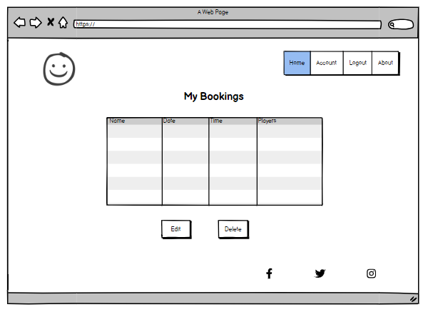

# Golf Booking Site

## Table of Contents:

1. UX-Design
    - Planning
        - Design Thinking 
        - Agile
        - User Stories
        - Website Flow
    - WireFrames
        - Styles
        - Fonts
        - Colours

2. Database Model
    - ERD

3. Features
    - Existing Features
    - Future Features

4. Technologies Used
    - Languages
    - Frameworks and Libraries
    - Tools

5. Manual Testing
    - Responsiveness
    - Browser Compatibility
    - Lighthouse
    - Code Validation
    - User Stories
    - Features
    - Bugs

6. Deployment
    - Heroku

7. References
    - Credits

## UX-Design
### Planning
#### Design Thinking:

From the start when developing this website I imagined the site from the users perspective. This immediately posed questions such as: 
- Why would a user want to visit this website?
    - The website provides a service for booking tee times on our golf course.
- What would bring a user back to the website?
    - A user would return to the website if they experience a user-friendly interface with easy navigation and a streamlined booking service.

#### Agile Planning:

An agile approach was taken for the planning of this website. This allowed me to take an iterative strategy towards the projects goals and break down milestones into smaller tasks. Also this allowed me to be flexible throughout the websites development and refine, adjust and add features to the website as needed. A kanban board was implemented for the project where I could assign labels of 'Must Have', 'Could Have' and 'Should Have' to my user stories. As I worked on and completed each I moved them from 'Todo' to 'In Progress' to 'Done' which gave me a clear plan of what stage the project was in and which features took priority.  

#### User Stories:

The user stories were written from the users perspective. This gave me the opportunity to envisage what a user would want to see on the home page etc. The following user stories were completed throughtout the development of the website:
- New User Registration
    - As a 'non-registered user' I can 'create an account' so that 'I can sign in to my account'.
- Login/Logout
    - As a 'registered user' I can 'login and logout' so that 'I can access my account securely'.
- Make a Booking
    - As a 'registered user' I can 'access the book tee time page' so that 'I can book a tee time'.
- Update a Booking
    - As a 'registered user' I can 'access my bookings' so that 'I can update my bookings'.
- Delete a Booking
    - As a 'registered user' I can 'access my bookings' so that 'I can cancel a booking'.

#### Website Flow:

Writing the user stories allowed me to visualise how the website would take form and what features should be where and when they should be there.

### Wireframes

Balsamiq was leveraged for making wireframes which would guide the development process.

- Home page

- Registration page

- Login page

- Booking page

- My bookings page

#### Styles:

#### Fonts:

#### Colours:

### Database Model
#### ERD:

- The ERD shows the booking model and its associated fields, the user field has a many to one relationship with djangos built-in User model as a single user can have many bookings but each booking is related to only one user.

### Features
#### Existing Features:

- Header

This includes the title/logo of the golf course and navigational links.

- Footer

This includes the social media links for the golf course.

- Register New Account

This allows a user to register a new account.

- Login

This provides log in functionality.

